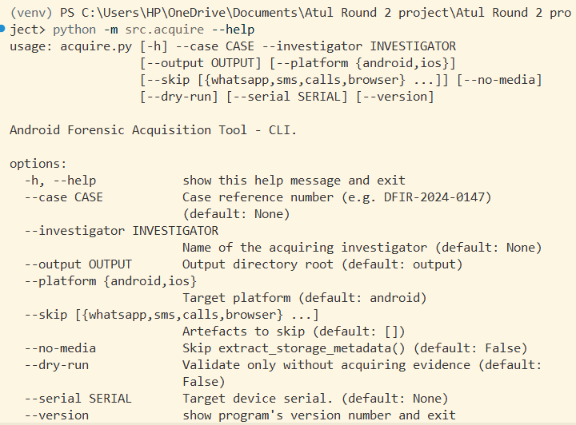
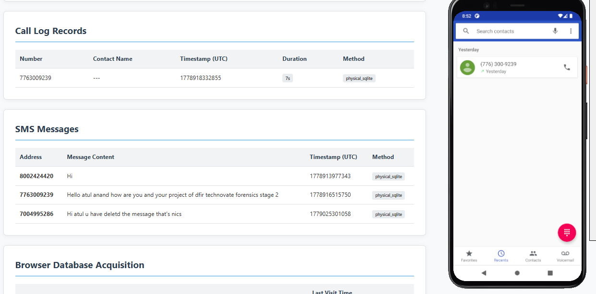
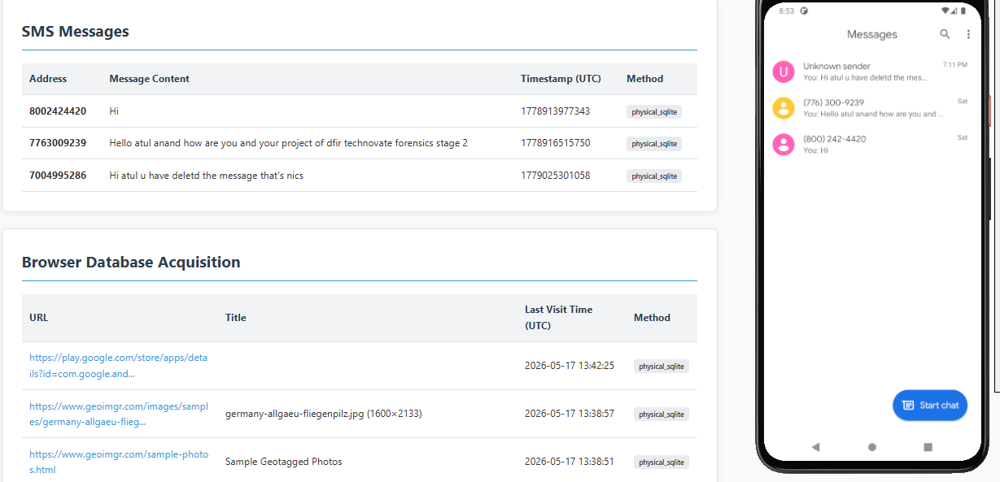
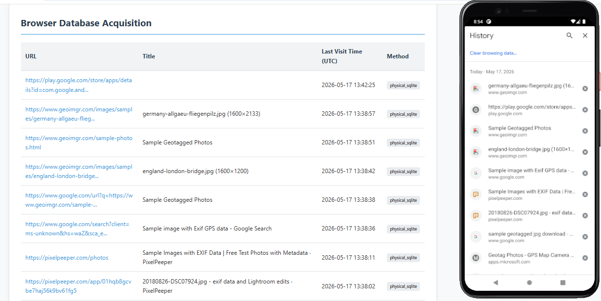
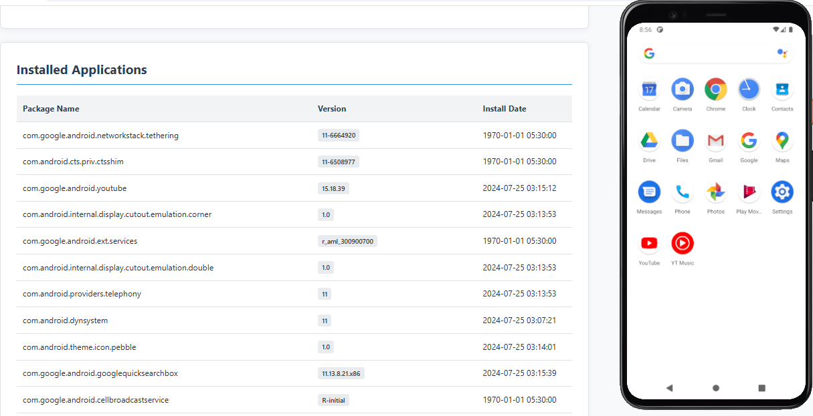
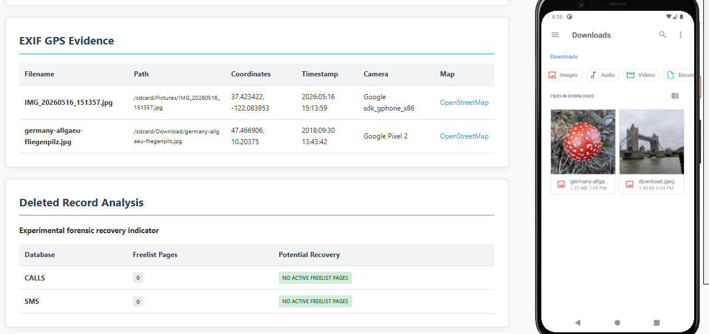

# NFSU Android Forensic Acquisition Tool

A forensic acquisition and reporting framework developed for the NFSU DFIR Mini Project using Python and adb-shell.
The tool performs logical Android evidence acquisition, integrity verification, SQLite parsing, forensic reporting, and dashboard-based visualization while maintaining chain-of-custody principles.
It supports extraction of installed applications, call logs, SMS records, browser history, media metadata, EXIF GPS evidence, integrity hashing, and forensic timeline generation.

---

# Features

## Core Acquisition Features

* Android device acquisition using `adb-shell`
* Installed application enumeration
* Call log extraction and parsing
* SMS database extraction and parsing
* Chrome browser history acquisition
* External storage metadata acquisition
* SHA-256 evidence hashing
* JSON + HTML forensic reporting
* Immutable UTC forensic logging
* CLI-driven acquisition workflow
* Flask dashboard for live acquisition monitoring

---

# Bonus Features Implemented

## 1. Unified Timeline Aggregation

Combines:

* SMS timestamps
* Call timestamps
* Browser history visits
* Application install times

into a single chronological forensic timeline.

---

## 2. EXIF GPS Extraction

Extracts:

* GPS coordinates
* Camera make/model
* Timestamp metadata
* OpenStreetMap links

from geotagged media files discovered during acquisition.

Example extracted evidence:

* IMG_20260516_151357.jpg
* germany-allgaeu-fliegenpilz.jpg

---

## 3. Deleted Record Analysis

Performs SQLite freelist analysis on:

* calllog.db
* mmssms.db

to identify whether deleted recoverable pages may exist.

---

## 4. Android Emulator Support

Supports acquisition against Android AVD emulators for offline DFIR testing and validation.

---
# Screenshots

## CLI Interface



Demonstrates the rubric-compliant argparse acquisition workflow.

---

## Call Log Acquisition



Shows forensic extraction and SQLite parsing of Android call records.

---

## SMS Database Extraction



Demonstrates successful acquisition and parsing of SMS artefacts.

---

## Browser History Acquisition



Shows Chrome browser history extraction from forensic SQLite databases.

---

## Installed Application Enumeration



Demonstrates installed package enumeration with metadata extraction.

---

## EXIF GPS Extraction & Deleted Record Analysis



Shows GPS metadata extraction and SQLite freelist deleted-record analysis.

# Project Structure

```text
project/
│
├── src/
│   ├── acquire.py
│   ├── device.py
│   ├── extractor.py
│   ├── parser.py
│   ├── reporter.py
│   ├── logger.py
│   ├── hasher.py
│   └── utils.py
│
├── templates/
│   └── report.html.j2
│
├── tests/
│   ├── test_bonus.py
│   ├── test_hasher.py
│   ├── test_logger.py
│   ├── test_parser.py
│   └── test_reporter.py
│
├── dashboard.py
├── START_DASHBOARD.bat
├── requirements.txt
└── README.md
```

---

# Prerequisites

## Supported Platform

* Android only

## Operating System

Tested on:

* Windows 10
* Windows 11

## Python Version

* Python 3.11+

## Android Requirements

* USB Debugging enabled
* Developer Options enabled
* adb authorization accepted

## System Dependencies

Install Android SDK Platform Tools:

* adb
* fastboot

ADB must be accessible through PATH.

---

# Installation

## 1. Clone Repository

```bash
git clone https://github.com/Atul2512anand/NFSU-DFIR.git
cd NFSU-DFIR
```

## 2. Create Virtual Environment

```bash
python -m venv venv
```

## 3. Activate Virtual Environment

### Windows

```bash
venv\Scripts\activate
```

### Linux/macOS

```bash
source venv/bin/activate
```

## 4. Install Requirements

```bash
pip install -r requirements.txt
```

## 5. Verify Device Connectivity

```bash
adb devices
```

Expected:

```text
List of devices attached
USB_DEVICE    device
```

---

# Usage

---

## Example 1 — Standard Acquisition

```bash
python -m src.acquire --case DFIR-2026-001 --investigator "Atul Anand"
```

### Expected Result

* Device metadata displayed
* Acquisition begins
* Evidence folder generated
* HTML + JSON reports created

---

## Example 2 — Dry Run Validation

```bash
python -m src.acquire --case TEST-001 --investigator "Atul Anand" --dry-run
```

### Expected Result

* Device detected
* Artefacts listed
* No evidence extraction performed

---

## Example 3 — Skip Browser Extraction

```bash
python -m src.acquire --case DFIR-2026-002 --investigator "Atul Anand" --skip browser
```

### Expected Result

* Browser acquisition skipped
* Other artefacts acquired normally

---

## Example 4 — Dashboard Mode

```bash
python dashboard.py
```

Then open:

```text
http://127.0.0.1:5000
```

### Expected Result

* Live acquisition dashboard
* Device scan interface
* Real-time forensic progress
* Interactive evidence report generation

---

# Evidence Output Structure

```text
output/
└── evidence_USB_DEVICE_YYYYMMDD_HHMMSS/
    ├── acquisition.log
    ├── manifest.json
    ├── report.html
    ├── report.json
    │
    ├── artefacts/
    │   ├── installed_apps/
    │   ├── call_log/
    │   ├── sms/
    │   ├── browser_history/
    │   ├── whatsapp/
    │   └── media_metadata/
    │
    └── integrity/
```

---

# Evidence File Descriptions

| File                         | Purpose                            |
| ---------------------------- | ---------------------------------- |
| acquisition.log              | Immutable forensic activity log    |
| manifest.json                | SHA-256 integrity manifest         |
| report.html                  | Human-readable forensic report     |
| report.json                  | Structured machine-readable report |
| apps.json                    | Installed applications             |
| call_logs.json               | Parsed call records                |
| sms_messages.json            | Parsed SMS messages                |
| browser_history.json         | Chrome browsing history            |
| storage_manifest.json        | External storage inventory         |
| exif_locations.json          | Geotagged media evidence           |
| deleted_record_analysis.json | SQLite deleted-record indicators   |

---

# Design Decisions

## 1. Using adb-shell Instead of subprocess adb

The project uses `adb-shell` directly instead of invoking external adb subprocesses to comply strictly with the NFSU rubric requirements and improve programmatic control over device communication.

---

## 2. Append-Only UTC Logging

The logging architecture uses immutable append-only UTC timestamped logging to preserve forensic chain-of-custody integrity and ensure every acquisition action is traceable.

---

## 3. Modular Extractor Architecture

The acquisition workflow was separated into:

* device handling
* extraction
* parsing
* hashing
* reporting

to ensure each module maintains a single forensic responsibility and remains testable independently.

---

# Limitations

The tool currently does NOT support:

* Physical chip-off acquisition
* Full filesystem extraction on non-rooted devices
* iOS acquisition
* Encrypted WhatsApp database decryption
* SQLite deleted-record carving beyond freelist detection
* Live memory acquisition

Some artefacts require root privileges because Android sandboxing restricts direct access to protected databases.

---

# Testing

The repository includes offline pytest validation using sample forensic data.

Run tests:

```bash
pytest tests/
```

Validation includes:

* SHA-256 hash correctness
* SQLite parser validation
* Log formatting validation
* HTML report generation
* Timeline aggregation
* EXIF extraction handling
* Deleted-record analysis validation

---

# Emulator Support

The tool supports Android Studio AVD emulators.

Recommended emulator:

* Pixel API 30 (Google APIs)

Enable root:

```bash
adb root
```

This enables forensic testing without requiring a physical Android device.

---

# Tested On

## Physical Device

* Android Emulator (Pixel 2 XL)
* Android 11
* Google APIs x86 build

## Host Environment

* Windows 11
* Python 3.11.9

---

# Validation Results

```bash
flake8 src/ tests/ dashboard.py
```

Passed successfully.

```bash
pytest tests/
```

17/17 tests passed successfully.

---

# Author

Atul Anand
B.Tech – M.Tech Computer Science & Engineering (Cyber Security)
National Forensic Sciences University (NFSU)
